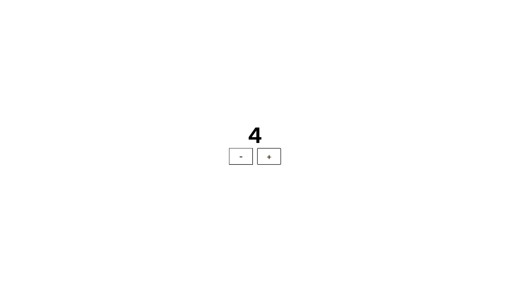

# React Counter App with Context API and useReducer

## Overview
This project is a simple counter application implemented in three different ways to understand and compare:

1. Using **React Context API only**
2. Using **useReducer only**
3. Using **both Context API and useReducer**

---

## Screenshots


## Objectives

- Understand how React Context API manages state globally
- Learn the `useReducer` hook for more scalable state management
- Combine Context API with useReducer for clean architecture

---

## Getting Started

1. Clone the repository:
   ```bash
   git clone https://github.com/ansabazys/context-api-useReducer.git
   cd context-api-useReducer
   ```

2. Install dependencies:
   ```bash
   npm install
   ```

3. Run the app:
   ```bash
   npm run dev
   ```

---

## What I Learned

- When and how to use Context API
- The benefits of using `useReducer` for state transitions

